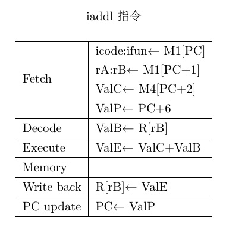

# ARCHLAB 报告

软件71 唐建宇 2017012221

## PART A

### sum.ys

```
# Execution begins at address 0
  .pos 0
  irmovl stack,%esp
  call main
  halt

# Sample linked list
  .align 4
ele1:
  .long 0x00a
  .long ele2
ele2:
  .long 0x0b0
  .long ele3
ele3:
  .long 0xc00
  .long 0

main:
  pushl %ebp        #save %ebp
  rrmovl %esp,%ebp  #new %ebp
  irmovl ele1,%edi  #set edi=the start of the list
  pushl %edi        #put the argument into the stack before calling
  call sum_list
  rrmovl %ebp,%esp  #restore %esp
  popl %ebp         #restore %ebp
  ret

#sum_list(list_ptr ls)

sum_list:
  pushl %ebp            #save %ebp
  rrmovl %esp,%ebp      #new %ebp
  irmovl $4,%ecx        #set constant 4
  xorl %eax,%eax        #set sum=0
  mrmovl 8(%ebp),%esi   #get the value of ls
  pushl %esi            #callee save %esi
  andl %esi,%esi
  jmp test              #start while
loop:
  mrmovl (%esi),%edx    #%edx=ls->val
  addl %edx,%eax        #sum+=ls->val
  addl %ecx,%esi        #ls+=4
  mrmovl (%esi),%esi    #ls=ls->next
  andl %esi,%esi
test:
  jne loop              #if ls>0
  popl %esi             #restore %esi
  rrmovl %ebp,%esp      #restore %esp
  popl %ebp             #restore %ebp
  ret

  .pos 0x200
stack:
```


### rsum.ys

```
# Execution begins at address 0
  .pos 0
  irmovl stack,%esp
  call main
  halt

# Sample linked list
  .align 4
ele1:
  .long 0x00a
  .long ele2
ele2:
  .long 0x0b0
  .long ele3
ele3:
  .long 0xc00
  .long 0

main:
  pushl %ebp        #save %ebp
  rrmovl %esp,%ebp  #new %ebp
  irmovl ele1,%edi
  pushl %edi        #put the argument into the stack before calling
  call rsum_list    #call
  rrmovl %ebp,%esp  #restore %esp
  popl %ebp         #restore %ebp
  ret

#rsum_list(list_ptr ls)

rsum_list:
  pushl %ebp            #save %ebp
  rrmovl %esp,%ebp      #new %ebp
  pushl %esi            #callee save %esi
  irmovl $4,%ecx        #set constant 4
  xorl %eax,%eax        #set return value=0
  mrmovl 8(%ebp),%esi   #get the value of ls
  andl %esi,%esi        #test if %esi=0
  je end                #if(!ls) goto end
  mrmovl (%esi),%edx    #%edx=ls->val
  pushl %edx            #save %edx=val
  addl %ecx,%esi        #ls+=4
  mrmovl (%esi),%esi    #ls=ls->next
  pushl %esi            #put the argument ls->next into the stack before calling
  call rsum_list        #rest=rsum_list(ls->next)
  popl %edx             #restore %edx=val
  popl %edx             #restore %edx=val
  addl %edx,%eax        #result=val+rest
end:
  rrmovl %ebp,%esp      #restore %esp
  popl %esi             #restore %esi
  popl %ebp             #restore %ebp
  ret

  .pos 0x200
stack:
```


### copy.ys

```
# Execution begins at address 0
  .pos 0
  irmovl stack,%esp
  call main
  halt

.align 4
# Source block
src:
.long 0x00a
.long 0x0b0
.long 0xc00
# Destination block
dest:
.long 0x111
.long 0x222
.long 0x333

main:
  pushl %ebp          #save %ebp
  rrmovl %esp,%ebp    #new %ebp
  irmovl $3,%edx      #%edx=len=3
  pushl %edx
  irmovl dest,%edx    #%edx=dest
  pushl %edx
  irmovl src,%edx     #%edx=src
  pushl %edx
  call copy_block
  rrmovl %ebp,%esp    #leave
  popl %ebp           #restore %ebp
  ret

#copy_block(int *src, int *dest, int len)
#argument in edi,esi,edx

copy_block:
  pushl %ebp           #save %ebp
  rrmovl %esp,%ebp     #new %ebp
  pushl %esi           #callee save %esi
  irmovl $0,%eax       #set result(return value)=0
  mrmovl 16(%esp),%edx #%edx=len
  mrmovl 12(%esp),%esi #%esi=dest
  mrmovl 8(%esp),%edi  #%edi=src
  andl %edx,%edx       #set CC
  jmp test
loop:
  mrmovl (%edi),%ebx  #val=*src
  irmovl $4,%ecx      #set constant 4
  addl %ecx,%edi      #src++
  rmmovl %ebx,(%esi)  #dest=val
  addl %ecx,%esi      #dest++
  xorl %ebx,%eax      #result^=val
  irmovl $1,%ecx      #set constant 1
  subl %ecx,%edx      #len--
test:
  jne loop              #if len>0 do
  popl %esi             #restore %esi
  rrmovl %ebp,%esp      #restore %esp
  popl %ebp             #restore %ebp
  ret

  .pos 0x200
stack:
```


***

##  PART B

###指令的实现步骤

#### IIADDL



#### ILEAVE


***

### SEQ处理器HCL文件的修改

按照两个指令按上述方法拆分得到的步骤，在HCL文件中进行对应的修改。涉及到的 HCL 文件修改会在需要修改每行的代码行末注明所进行的修改。

#### 1.取指阶段

```
bool instr_valid = icode in 
	{ INOP, IHALT, IRRMOVL, IIRMOVL, IRMMOVL, IMRMOVL,
	       IOPL, IJXX, ICALL, IRET, IPUSHL, IPOPL, IIADDL, ILEAVE };
	#加入了 IIADDL,ILEAVE

# Does fetched instruction require a regid byte?
bool need_regids =
	icode in { IRRMOVL, IOPL, IPUSHL, IPOPL, 
		     IIRMOVL, IRMMOVL, IMRMOVL, IIADDL };                      #加入了 IIADDL

# Does fetched instruction require a constant word?
bool need_valC =
	icode in { IIRMOVL, IRMMOVL, IMRMOVL, IJXX, ICALL, IIADDL };       #加入了 IIADDL

```

首先将 IIADDL 和 ILEAVE 两个指令加入 instr_valid 中。

由于 IIADDL 需要寄存器和 ValC 作为参数，因此在 need_regids 和 need_valC 加入IIADDL。


#### 2.译码阶段

```

## What register should be used as the A source?

int srcA = [
    icode in { IRRMOVL, IRMMOVL, IOPL, IPUSHL  } : rA;
    icode in { IPOPL, IRET } : RESP;
        icode in { ILEAVE } : REBP;                         #加入ILEAVE
    1 : RNONE; # Don't need register
];      

#What register should be used as the B source?

int srcB = [
    icode in { IOPL, IRMMOVL, IMRMOVL, IIADDL  } : rB;      #加入IIADDL
    icode in { IPUSHL, IPOPL, ICALL, IRET } : RESP;
    1 : RNONE;  # Don't need register
];

What register should be used as the E destination?

int dstE = [
    icode in { IRRMOVL } && Cnd : rB;
    icode in { IIRMOVL, IOPL, IIADDL} : rB;                  #加入IIADDL
    icode in { IPUSHL, IPOPL, ICALL, IRET, ILEAVE } : RESP;  #加入ILEAVE
    1 : RNONE;  # Don't write any register
];

What register should be used as the M destination?

int dstM = [
    icode in { IMRMOVL, IPOPL } : rA;
        icode in { ILEAVE } : REBP;                          #加入ILEAVE
    1 : RNONE;  # Don't write any register
];`

```

由于 IIADDL 需要在译码阶段将 rB 寄存器的值读入 ValB 中，因此在 srcB 中的 rB 部分加入 IIADDL；而写回阶段中，需要把 ALU 计算得到的 ValE 值重新写入 rB 寄存器，因此在 dstM 中的 rB 部分加入 IIADDL。

由于 ILEAVE 需要在在译码阶段将 %ebp 寄存器的值读入 ValA 中，因此在 srcA 中的 rA 部分加入 ILEAVE；而写回阶段中，需要把 ALU 计算得到的 ValE 值和访存得到的 ValM 值分别写入 %esp 寄存器和 %ebp 寄存器，因此在 dstE 中的 RESP 部分加入 ILEAVE，在 dstE 中的 REBP 部分加入 ILEAVE。

#### 3.执行阶段

```
## Select input A to ALU
int aluA = [
	icode in { IRRMOVL, IOPL } : valA;
	icode in { IIRMOVL, IRMMOVL, IMRMOVL, IIADDL } : valC;       #加入 IIADDL
	icode in { ICALL, IPUSHL } : -4;
	icode in { IRET, IPOPL, ILEAVE } : 4;                        #加入 ILEAVE
	# Other instructions don't need ALU
];

## Select input B to ALU
int aluB = [
	icode in { IRMMOVL, IMRMOVL, IOPL, ICALL, 
		      IPUSHL, IRET, IPOPL,  IIADDL } : valB;             #加入 IIADDL
	icode in { ILEAVE } : valA;	                                 #加入 ILEAVE
	icode in { IRRMOVL, IIRMOVL } : 0;
	# Other instructions don't need ALU
];

## Should the condition codes be updated?
bool set_cc = icode in { IOPL, IIADDL };                          #加入 IIADDL
```

在执行阶段，IIADDL 的操作是将 ValC 和 ValB 相加，因此在 aluA 中的 ValC 部分加入 IIADDL，在 aluB 中的 ValB 部分加入 IIADDL。同时作为加法运算，IIADDL 需要更新条件码，因此在 set_cc 中加入IIADDL 。

ILEAVE 的操作是将 ValA 与 4 相加，因此在 aluA 中的 4 部分加入 ILEAVE，在 aluB 中的 ValA 部分加入 ILEAVE。

#### 4.访存阶段

```
## Set read control signal
bool mem_read = icode in { IMRMOVL, IPOPL, IRET, ILEAVE };      #加入ILEAVE

## Select memory address
int mem_addr = [
	icode in { IRMMOVL, IPUSHL, ICALL, IMRMOVL } : valE;
	icode in { IPOPL, IRET, ILEAVE } : valA;                    #加入ILEAVE
	# Other instructions don't need address
];
```

在访存阶段，IIADDL 无需操作，只有 ILEAVE 需要读取内存上 ValA 地址上的数据，即 M1[ValA]。因此在 mem_read 中加入 ILEAVE，在 mem_addr 中加入地址为 ValA 的部分加入 ILEAVE。

#### 5.PC更新阶段

因为 ILEAVE 和 IIADDL 两个指令本身都不涉及跳转，下一条执行的地址均为默认值 ValP ，因此这一部分代码不需要修改。

***

### PIPELINE处理器HCL文件的修改

流水线处理器的修改部分与顺序执行处理器类似，同样按照拆分的步骤进行修改。

#### 1.取指阶段

```
# Is instruction valid?
bool instr_valid = f_icode in 
	{ INOP, IHALT, IRRMOVL, IIRMOVL, IRMMOVL, IMRMOVL,
	  IOPL, IJXX, ICALL, IRET, IPUSHL, IPOPL, IIADDL, ILEAVE };      #加入IIADDL, ILEAVE

# Does fetched instruction require a regid byte?
bool need_regids =
	f_icode in { IRRMOVL, IOPL, IPUSHL, IPOPL, 
		     IIRMOVL, IRMMOVL, IMRMOVL, IIADDL };                    #加入IIADDL

# Does fetched instruction require a constant word?
bool need_valC =
	f_icode in { IIRMOVL, IRMMOVL, IMRMOVL, IJXX, ICALL, IIADDL };   #加入IIADDL
```

首先将 IIADDL 和 ILEAVE 两个指令加入 instr_valid 中。

由于 IIADDL 需要寄存器和 ValC 作为参数，因此在 need_regids 和 need_valC 加入IIADDL。

在预测PC的逻辑中，因为两个指令均不涉及跳转，因此无需改动采用默认的 f_valP 即可。


#### 2.译码阶段

```
## What register should be used as the A source?
int d_srcA = [
	D_icode in { IRRMOVL, IRMMOVL, IOPL, IPUSHL  } : D_rA;
	D_icode in { IPOPL, IRET } : RESP;
        D_icode in { ILEAVE } : REBP;                            #加入ILEAVE
	1 : RNONE; # Don't need register
];

## What register should be used as the B source?
int d_srcB = [
	D_icode in { IOPL, IRMMOVL, IMRMOVL, IIADDL  } : D_rB;      #加入IIADDL
	D_icode in { IPUSHL, IPOPL, ICALL, IRET } : RESP;
	1 : RNONE;  # Don't need register
];

## What register should be used as the E destination?
int d_dstE = [
	D_icode in { IRRMOVL, IIRMOVL, IOPL, IIADDL } : D_rB;       #加入IIADDL
	D_icode in { IPUSHL, IPOPL, ICALL, IRET, ILEAVE } : RESP;   #加入ILEAVE
	1 : RNONE;  # Don't write any register
];

## What register should be used as the M destination?
int d_dstM = [
	D_icode in { IMRMOVL, IPOPL } : D_rA;
        D_icode in { ILEAVE } : REBP;                           #加入ILEAVE
	1 : RNONE;  # Don't write any register
];
```

由于 IIADDL 需要在译码阶段将 rB 寄存器的值读入 ValB 中，因此在 srcB 中的 rB 部分加入 IIADDL；而写回阶段中，需要把 ALU 计算得到的 ValE 值重新写入 rB 寄存器，因此在 dstM 中的 rB 部分加入 IIADDL。

由于 ILEAVE 需要在在译码阶段将 %ebp 寄存器的值读入 ValA 中，因此在 srcA 中的 rA 部分加入 ILEAVE；而写回阶段中，需要把 ALU 计算得到的 ValE 值和访存得到的 ValM 值分别写入 %esp 寄存器和 %ebp 寄存器，因此在 dstE 中的 RESP 部分加入 ILEAVE，在 dstE 中的 REBP 部分加入 ILEAVE。

#### 3.执行阶段

```
## Select input A to ALU
int aluA = [
	E_icode in { IRRMOVL, IOPL } : E_valA;
	E_icode in { IIRMOVL, IRMMOVL, IMRMOVL, IIADDL } : E_valC;      #加入IIADDL
	E_icode in { ICALL, IPUSHL } : -4;
	E_icode in { IRET, IPOPL, ILEAVE } : 4;                         #加入ILEAVE
	# Other instructions don't need ALU
];

## Select input B to ALU
int aluB = [
	E_icode in { IRMMOVL, IMRMOVL, IOPL, ICALL, 
		     IPUSHL, IRET, IPOPL, IIADDL} : E_valB;                 #加入IIADDL
	E_icode in {  ILEAVE } : E_valA;                                #加入ILEAVE
	E_icode in { IRRMOVL, IIRMOVL } : 0;
	# Other instructions don't need ALU
];

## Should the condition codes be updated?
bool set_cc = (E_icode == IIADDL) || (E_icode == IOPL &&            #加入IIADDL
	# State changes only during normal operation
	!m_stat in { SADR, SINS, SHLT } && !W_stat in { SADR, SINS, SHLT });
```

在执行阶段，IIADDL 的操作是将 ValC 和 ValB 相加，因此在 aluA 中的 ValC 部分加入 IIADDL，在 aluB 中的 ValB 部分加入 IIADDL。同时作为加法运算，IIADDL 需要更新条件码，因此在 set_cc 中加入IIADDL ，由于原先只有 E_icode 为 IOPL 且满足一些条件时才需要更新条件码，因此在这里将 `E_icode ==IIADDL  ` 与 ` E_icode == IOPL && !m_stat in { SADR, SINS, SHLT } && !W_stat in { SADR, SINS, SHLT }`用 **或** 的逻辑连接。

ILEAVE 的操作是将 ValA 与 4 相加，因此在 aluA 中的 4 部分加入 ILEAVE，在 aluB 中的 ValA 部分加入 ILEAVE。

#### 4.访存阶段

```
## Select memory address
int mem_addr = [
	M_icode in { IRMMOVL, IPUSHL, ICALL, IMRMOVL } : M_valE; 
	M_icode in { IPOPL, IRET, ILEAVE } : M_valA;                       #加入ILEAVE
	# Other instructions don't need address
];

## Set read control signal
bool mem_read = M_icode in { IMRMOVL, IPOPL, IRET, ILEAVE };
```

在访存阶段，IIADDL 无需操作，只有 ILEAVE 需要读取内存上 ValA 地址上的数据，即 M1[ValA]。因此在 mem_read 中加入 ILEAVE，在 mem_addr 中加入地址为 ValA 的部分加入 ILEAVE。

#### 5.PC更新阶段

因为 ILEAVE 和 IIADDL 两个指令本身都不涉及跳转，下一条执行的地址均为默认值 ValP ，因此这一部分代码不需要修改。

***

## PART C

第三部分中，一共增加了三个指令：I_RMXCHG, I_IALU(包含 iaddl, isubl, iandl, ixorl ), I_TEST(包含testl 和 cmpl)。但因为已有的指令以达14个，而支持的指令总数不超过16个，因此将这三个指令**分成了两部分**放在**两个sim文件夹**中，还望助教谅解。

### I_RMXCHG

指令格式  rmxchg rA, D(rB)

####实现步骤


####指令集模拟器修改

1. 在 sim/misc/yas-grammar.lex文件中Instr部分加入rmxchg


2. 在 sim/misc/isa.h文件中itype_t部分加入I_RMXCHG

3. 在 sim/misc/isa.c文件中的改动

   - instruction_set 中加入 rmxchg 指令格式

   - 在need_regids和need_imm中加入hi0 == I_RMXCHG，因为需要寄存器和立即数

   - 修改 step_state 函数中switch 部分加入 I_RMXCHG 的执行逻辑：

     ```c
     case I_RMXCHG:
     	if (!ok1) {
     	    if (error_file)
     		fprintf(error_file,
     			"PC = 0x%x, Invalid instruction address\n", s->pc);
     	    return STAT_ADR;
     	}
     	if (!okc) {
     	    if (error_file)
     		fprintf(error_file,
     			"PC = 0x%x, Invalid instruction addres\n", s->pc);
     	    return STAT_INS;
     	}
     	if (!reg_valid(hi1)) {
     	    if (error_file)
     		fprintf(error_file,
     			"PC = 0x%x, Invalid register ID 0x%.1x\n",
     			s->pc, hi1);
     	    return STAT_INS;
     	}
     	if (reg_valid(lo1)) 
     	    cval += get_reg_val(s->r, lo1);
     	if (!get_word_val(s->m, cval, &val))
     	    return STAT_ADR;
     	if (reg_valid(hi1)) 
     	    dval = get_reg_val(s->r, hi1);        
     	set_reg_val(s->r, hi1, val);
     	if (!set_word_val(s->m, cval, dval)) {
     	    if (error_file)
     		fprintf(error_file,
     			"PC = 0x%x, Invalid data address 0x%x\n",
     			s->pc, cval);
     	    return STAT_ADR;
     	}       
     	s->pc = ftpc;
     	break;
     ```

#### SEQ/PIPE处理器模拟器修改

与PART2 中修改类似地，将各个步骤拆解得的结果分别填入hcl 文件中的对应位置即可。

唯一不同的是，这个指令涉及到的对内存的写入操作存在数据冒险，且无法通过数据转发解决，因此仿照MRMOVL指令对控制部分加入相应的判断即可。


***

### I_IALU

#### 指令

- iaddl V, rB
- isubl V, rB
- iandl V, rB
- ixorl V, rB

#### 实现步骤


#### 指令集模拟器修改

1. 在 sim/misc/yas-grammar.lex文件中Instr部分加入isubl, iandl, ixorl 指令


1. 在 sim/misc/isa.h文件中itype_t部分加入I_IALU

2. 在 sim/misc/isa.c文件中的改动

   - instruction_set 中加入 isubl, iandl, ixorl 指令

   - 在need_regids中加入hi0 == I_IALU，因为需要寄存器

   - 修改 step_state 函数中switch 部分加入 I_IALU 的执行逻辑：

     ```c

     case I_IALU:
     	if (!ok1) {
     	    if (error_file)
     		fprintf(error_file,
     			"PC = 0x%x, Invalid instruction address\n", s->pc);
     	    return STAT_ADR;
     	}
     	if (!okc) {
     	    if (error_file)
     		fprintf(error_file,
     			"PC = 0x%x, Invalid instruction address",
     			s->pc);
     	    return STAT_INS;
     	}
     	if (!reg_valid(lo1)) {
     	    if (error_file)
     		fprintf(error_file,
     			"PC = 0x%x, Invalid register ID 0x%.1x\n",
     			s->pc, lo1);
     	    return STAT_INS;
     	}
     	argB = get_reg_val(s->r, lo1);
     	val = compute_alu(lo0, cval, argB);
     	set_reg_val(s->r, lo1, val);
     	s->cc = compute_cc(lo0, cval, argB);
     	s->pc = ftpc;
     	break;
     ```

#### SEQ/PIPE处理器模拟器修改

同仿照PARTB，不涉及内存访问，无需特别注意的点。

***

### I_TEST

#### 指令

- testl  rA, rB
- cmpl rA, rB

#### 实现步骤


#### 指令集模拟器修改过程

1. 在 sim/misc/yas-grammar.lex文件中Instr部分加入isubl, iandl, ixorl 指令


1. 在 sim/misc/isa.h文件中itype_t部分加入I_IALU

2. 在 sim/misc/isa.c文件中的改动

   - instruction_set 中加入 isubl, iandl, ixorl 指令

   - 在need_regids中加入hi0 == I_IALU，因为需要寄存器

   - 修改 step_state 函数中switch 部分加入 I_IALU 的执行逻辑：

     ```
     case I_TEST:
     	if (!ok1) {
     	    if (error_file)
     		fprintf(error_file,
     			"PC = 0x%x, Invalid instruction address\n", s->pc);
     	    return STAT_ADR;
     	}
     	argA = get_reg_val(s->r, hi1);
     	argB = get_reg_val(s->r, lo1);
     	val = compute_alu(lo0, argA, argB);
     	s->cc = compute_cc(lo0, argA, argB);
     	s->pc = ftpc;
     	break;
     ```

#### SEQ/PIPE处理器模拟器修改

同仿照PARTB，不涉及内存访问，无需特别注意的点。

------

### 验证

#### ITEST的验证

基于 PART A 中实现的 rsum.ys 做了一些修改， 将递归求链表和中原本的判断语句 andl 换为了 testl 进行判断，因为是递归调用。

测试代码：

```
#rsum_list(list_ptr ls)

rsum_list:
  pushl %ebp            #save %ebp
  rrmovl %esp,%ebp      #new %ebp
  irmovl $0,%eax        #set return value=0
  irmovl $4,%ecx        #set constant 4
  mrmovl 8(%ebp),%esi   #get the value of ls
  testl %esi,%esi                                  #修改处
  je end                #if(!ls) goto end
  mrmovl (%esi),%edx    #%edx=ls->val
  pushl %edx            #save %edx=val
  addl %ecx,%esi        #ls+=4
  mrmovl (%esi),%esi    #ls=ls->next
  pushl %esi            #put the argument ls->next into the stack before calling
  call rsum_list        #rest=rsum_list(ls->next)
  popl %edx             #restore %edx=val
  popl %edx             #restore %edx=val
  addl %edx,%eax        #result=val+rest
end:
  rrmovl %ebp,%esp      #restore %esp
  popl %ebp             #restore %ebp
  ret
```

经测试，ISA指令集模拟器所得结果正确

PIPE/SEQ 处理器模拟器的结果与指令集相同，得到 ISA CHECK SUCCEED 的结果。

另一个指令 cmpl 因为与 testl 实现完全相同（仅ifun一处差别），因此认为 I_TEST 指令是正确的。

#### I_RMXCHG和I_IALU的验证

同样基于递归的程序 rsum.ys 进行修改，故意引入rmxchg指令交换内存与寄存器的值，如果这部操作有问题，那返回值和其他中间变量就会完全错误；将原有的 irmovl 赋值语句改为先用 irmovl 赋值为 0 ，再用 iaddl , isubl, iandl 进行实际的赋值，代码如下：

```
#rsum_list(list_ptr ls)

rsum_list:
  pushl %ebp            #save %ebp
  rrmovl %esp,%ebp      #new %ebp
  
  #修改部分代码######################################
  iandl $0,%ecx         #set 0
  iandl $0,%eax         #set 0
  iaddl $4,%eax         #get constant 4
  pushl %ecx
  rmxchg %eax,0(%esp)   #exchange to set eax=0
  popl %ecx             #set ecx to the exchanged value 4
  ####################################################
  
  mrmovl 8(%ebp),%esi   #get the value of ls
  andl %esi,%esi                                 
  je end                #if(!ls) goto end
  mrmovl (%esi),%edx    #%edx=ls->val
  pushl %edx            #save %edx=val
  addl %ecx,%esi        #ls+=4
  mrmovl (%esi),%esi    #ls=ls->next
  pushl %esi            #put the argument ls->next into the stack before calling
  call rsum_list        #rest=rsum_list(ls->next)
  popl %edx             #restore %edx=val
  popl %edx             #restore %edx=val
  addl %edx,%eax        #result=val+rest
end:
  rrmovl %ebp,%esp      #restore %esp
  popl %ebp             #restore %ebp
  ret
```

在这样的改动下如果如果递归函数依然得到正确结果说明改动没有问题。


对于pipe处理器的测试，也得到正确的结果


因此认为解决了数据冒险的问题。


***

## 感想

这次实验前两个部分非常简单，摸清了流水线处理器的工作流程就很快完成了任务，真的像老师上课说的做填空题一样。

但是PART C中感觉难度一下大了很多，一开始完全无从下手，然后只能慢慢读每个文件夹的README，渐渐明白整个lab的逻辑，misc起到指令集模拟器，我的理解是一个直接用c语言写成的执行指令的模拟器和编译器（对后面pipe和seq而言是一个标准或是裁判的作用，当然isa.h/c也提供了基本的执行功能），而pipe和seq则是将hcl变成可执行的模拟器，主要检验了hcl实现的正确性。在这样的理解下，我也找到了思路，完成了足够的修改，也通过了自己写的验证程序。

唯一的奇怪点在于，我实现的3种指令同时加进去就超过了16个指令，编译后多余的指令就会变成00 或者 01，也就是halt或者nop了，最后只能分到两个sim文件夹中分别实现，也希望助教谅解。